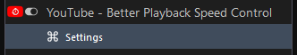
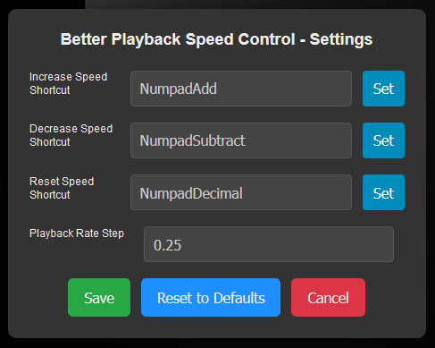

# YouTube - Better Playback Speed Control

BPSC allows you to have a better control over the speed of a video with customizable keyboard shortcuts to increase, decrease and reset playback rate, while also displaying relevant information directly in the video player.

## Features

- **Speed Override:** Increases maximum playback speed to 5x (up from YouTube's default 2x).
- **Time Remaining:** Shows the adjusted time to the end of the video at the current speed right in the video player.
- **Livestream Delay:** Displays how far behind you are in a livestream when rewinding.
- **Custom Shortcuts:** Configurable keyboard shortcuts.

## Installation

1. Install a userscript manager (like [Violentmonkey](https://violentmonkey.github.io/get-it/))
2. [Click here to install](https://github.com/WesternFreak/YouTube-Better-Playback-Speed-Control/raw/main/yt-bpsc.user.js) the script.

## How to Use

### Default Keyboard Shortcuts

- Increase playback speed: `Numpad +`
- Decrease playback speed: `Numpad -`
- Reset playback speed: `Numpad .`

### Customize Shortcuts

1. Click the userscript manager icon in your browser.
2. Locate the "YouTube - Better Playback Speed Control" in the menu then click "Customize Keybinds":
   

3. Use the menu to setup your desired keyboard shortcuts:
 

## Compatibility
Tested with LibreOffice 129.0.2-1 and Violentmonkey 2.20.0
